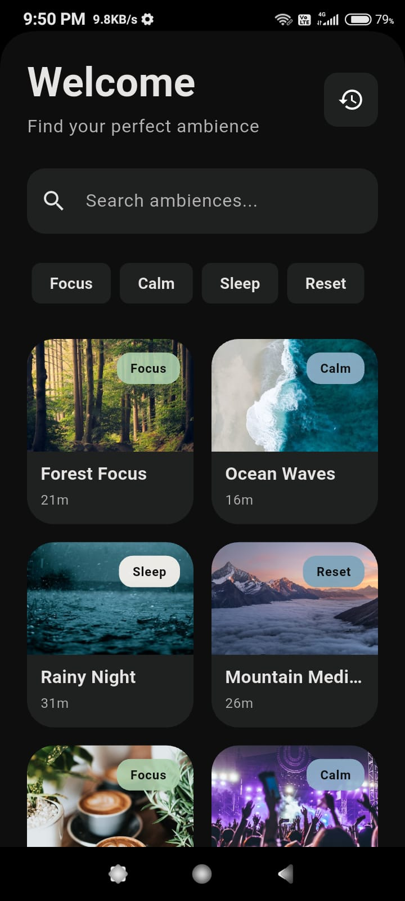
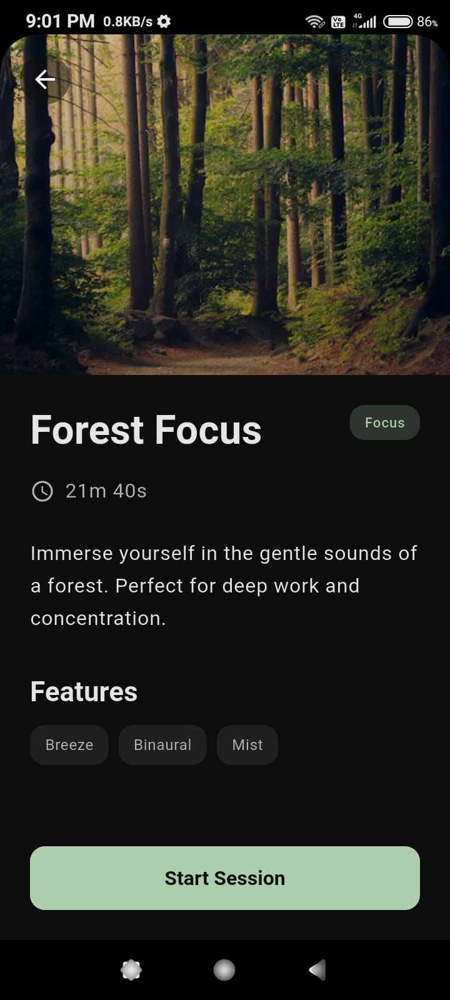
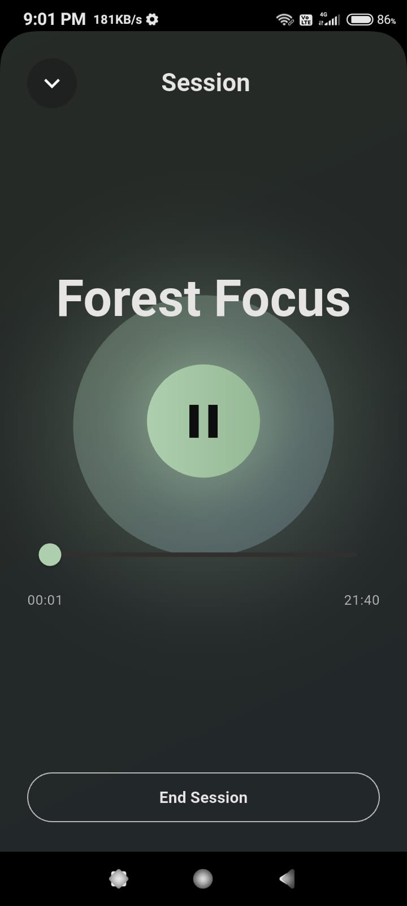
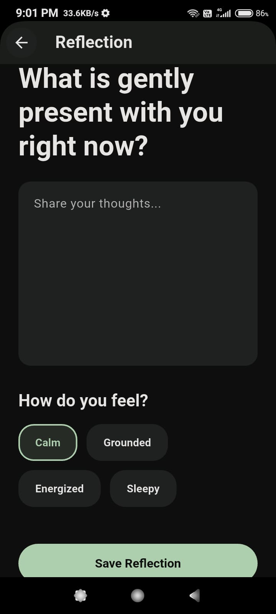
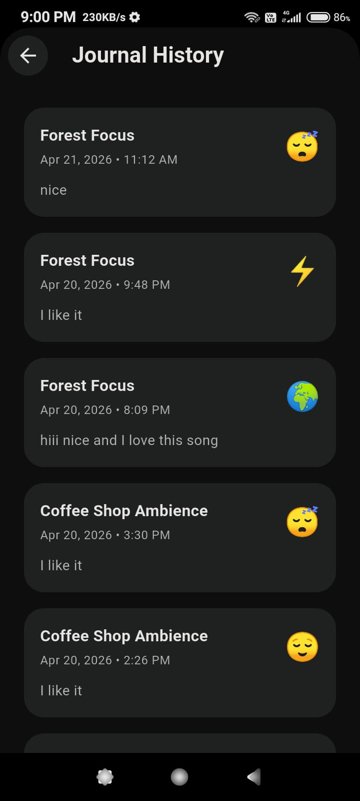
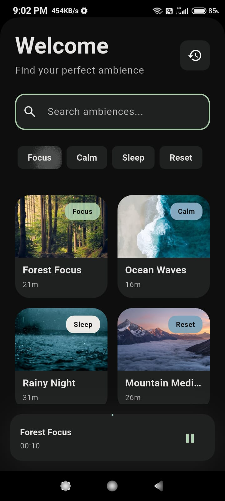

# 🎵 Immersive Session Journal

An elegant Flutter application that combines ambient soundscapes with mindfulness journaling. Create personalized immersive sessions with curated ambiences, track your journal entries, and revisit your memories with an intuitive interface powered by clean architecture principles.

---

## ✨ Features

🎧 **Ambience Library**
- Curated collection of ambient soundscapes
- Browse and preview ambiences
- Detailed information cards with descriptions

▶️ **Session Player**
- Play ambient audio with smooth controls
- Real-time playback progress tracking
- Pause, resume, and stop functionality
- Seamless audio management using `just_audio`

🎼 **Mini Player**
- Floating player widget
- Quick access from any screen
- Minimize/maximize controls
- Non-intrusive design

📔 **Journal & Reflection**
- Create journal entries during or after sessions
- Attach ambiences to entries
- Rich text support
- Timestamp tracking

📚 **Session History**
- View all past sessions
- Filter and search capabilities
- Revisit saved journal entries
- Session statistics and insights

---

## 📸 Screenshots

| Home Screen | Ambience Details | Player Screen | Journal Entry |
|---|---|---|---|
|  |  |  |  |

| History | Mini Player |
|---|---|
|  |  |

---

## 🛠 Tech Stack

| Technology | Purpose |
|---|---|
| **Flutter** | Cross-platform UI framework |
| **Riverpod** | State management & dependency injection |
| **Hive** | Local database (NoSQL) |
| **GoRouter** | Navigation & routing |
| **just_audio** | Audio playback engine |

---

## 🏗 Architecture

This project follows **Clean Architecture** principles for maintainability, testability, and scalability.

```
lib/
├── main.dart                 # App entry point
├── data/
│   ├── models/              # Data classes (Ambience, JournalEntry, SessionState)
│   └── repositories/        # Data access layer (Ambience, Journal, Session)
├── features/
│   ├── ambience/            # Ambience feature module
│   │   └── screens/
│   ├── home/                # Home feature module
│   │   └── screens/
│   ├── journal/             # Journal feature module
│   │   └── screens/
│   ├── player/              # Player feature module
│   │   └── screens/
│   └── (other features)
├── providers/               # Riverpod state providers
│   ├── ambience_provider.dart
│   ├── journal_provider.dart
│   └── session_provider.dart
├── routes/
│   └── router.dart          # GoRouter configuration
├── shared/
│   └── widgets/             # Reusable UI components
│       ├── ambience_card.dart
│       └── mini_player.dart
└── theme/
    └── app_theme.dart       # App theming & design system
```

### Architecture Layers:

- **UI Layer** (`features/`) - Screens and widgets
- **Provider Layer** (`providers/`) - State management with Riverpod
- **Data Layer** (`data/`) - Repositories and models
- **Local Storage** - Hive database for persistence

---

## 📊 Data Flow

```
User Interaction (UI)
        ↓
    Providers (Riverpod)
        ↓
    Repositories (Data Access)
        ↓
    Hive (Local Storage)
        ↓
    Return Data → Update UI
```

**Example: Playing an Ambience**
```
Player Screen → SessionProvider → SessionRepository → Hive DB
                                                          ↓
just_audio playback ← SessionProvider ← SessionRepository
```

---

## 🚀 Installation

### Prerequisites
- Flutter SDK (v3.0+)
- Dart SDK (v3.0+)
- Android SDK / iOS SDK (for mobile testing)

### Steps

1. **Clone the repository:**
   ```bash
   git clone https://github.com/KRISHNASAPKAL999/immersive-session-journal.git
   cd immersive_session_journal
   ```

2. **Install dependencies:**
   ```bash
   flutter pub get
   ```

3. **Generate code (for models with `json_serializable`):**
   ```bash
   flutter pub run build_runner build
   ```

4. **Run the app:**
   ```bash
   flutter run
   ```

### Build APK
```bash
flutter build apk --release
```

The APK will be available at: `build/app/outputs/flutter-apk/app-release.apk`

---

## 📦 APK Download

Download the latest release APK from the [Releases](apk/app-release.apk) page.

### Installation Instructions:
1. Enable "Unknown Sources" in your Android device settings
2. Download the APK file
3. Tap to install
4. Grant permissions when prompted
5. Launch and enjoy!


## 📋 Dependencies

```yaml
dependencies:
  flutter:
    sdk: flutter
  riverpod: ^2.0.0
  hive: ^2.2.0
  go_router: ^10.0.0
  just_audio: ^0.9.0
  path_provider: ^2.0.0

dev_dependencies:
  flutter_test:
    sdk: flutter
  hive_generator: ^2.0.0
  build_runner: ^2.3.0
```

---

## 🔄 Trade-offs & Design Decisions

### Trade-offs Made:

| Decision | Rationale | Trade-off |
|---|---|---|
| **Hive over Firebase** | Local-first, offline support, no backend dependency | No real-time sync, no cloud backup by default |
| **Riverpod over Provider** | Better code organization, compile-time safety | Slightly more boilerplate initially |
| **GoRouter** | Type-safe navigation, deep linking support | More setup than basic Navigator |
| **just_audio** | Rich features, active maintenance | Larger app size (+5MB) |

### Architecture Decisions:

✅ **Separation of Concerns** - Clean layers prevent tangled dependencies  
✅ **Repository Pattern** - Abstracts data sources for easy testing  
✅ **Provider Pattern** - Centralized state management  
✅ **Feature-based Structure** - Scalable module organization  

---

## 🔮 Future Improvements

- [ ] **Cloud Sync** - Sync sessions across devices (Firebase/Supabase)
- [ ] **Offline Sync** - Sync when connection is available
- [ ] **Custom Ambiences** - Allow users to upload/record their own
- [ ] **Social Sharing** - Share session insights and journal entries
- [ ] **Analytics Dashboard** - Visualize journaling trends
- [ ] **Dark Mode** - Theme toggle and dark mode support
- [ ] **Export Features** - Export journals as PDF/Markdown
- [ ] **AI Insights** - Smart suggestions based on journal entries
- [ ] **Reminders & Notifications** - Gentle prompts for daily journaling
- [ ] **Wearable Integration** - Support for smartwatch sessions

---

## 🤝 Contributing

Contributions are welcome! Please follow these steps:

1. Fork the repository
2. Create a feature branch (`git checkout -b feature/AmazingFeature`)
3. Commit changes (`git commit -m 'Add AmazingFeature'`)
4. Push to branch (`git push origin feature/AmazingFeature`)
5. Open a Pull Request


---

## 👨‍💻 Author

**Krishna Sapkal**
- 🔗 GitHub: [@KRISHNASAPKAL999](https://github.com/KRISHNASAPKAL999)
- 📧 Email: shrikrishnasapkal9@gmail.com

---

## 🙏 Acknowledgments

- Flutter team for the amazing framework
- Riverpod community for state management
- Open-source community for incredible packages
- All users and testers for feedback

---

<div align="center">

**Made with ❤️ by Krishna Sapkal**

⬆ Back to top

</div>
